# Argus Security Agents — Cyber Sentinel XDR Platform

> **Next-Generation Autonomous Multi-Agent Cybersecurity Platform**  
> *Smarter Detection · Faster Response · Autonomous Defense · Safer Tomorrow*

[](https://www.python.org/downloads/)
[](https://github.com/langchain-ai/langgraph)
[](https://fastapi.tiangolo.com/)
[](https://js.cytoscape.org/)
[](https://github.com/guardrails-ai/guardrails)
[](#-test-verification)

---

## 🖥️ Cyber Sentinel SOC Operations Platform

| Argus SOC Operations Center | Threat Infrastructure Graph & World Map |
| :---: | :---: |
| 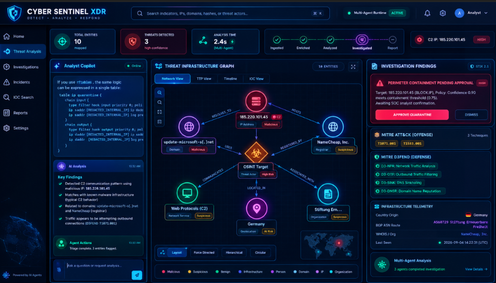 | 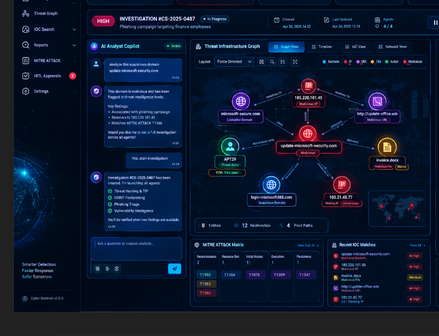 |

| Autonomous Quishing & Phishing Pipeline | Adversarial Arena & Blast Radius | Analyst AI Copilot |
| :---: | :---: | :---: |
| 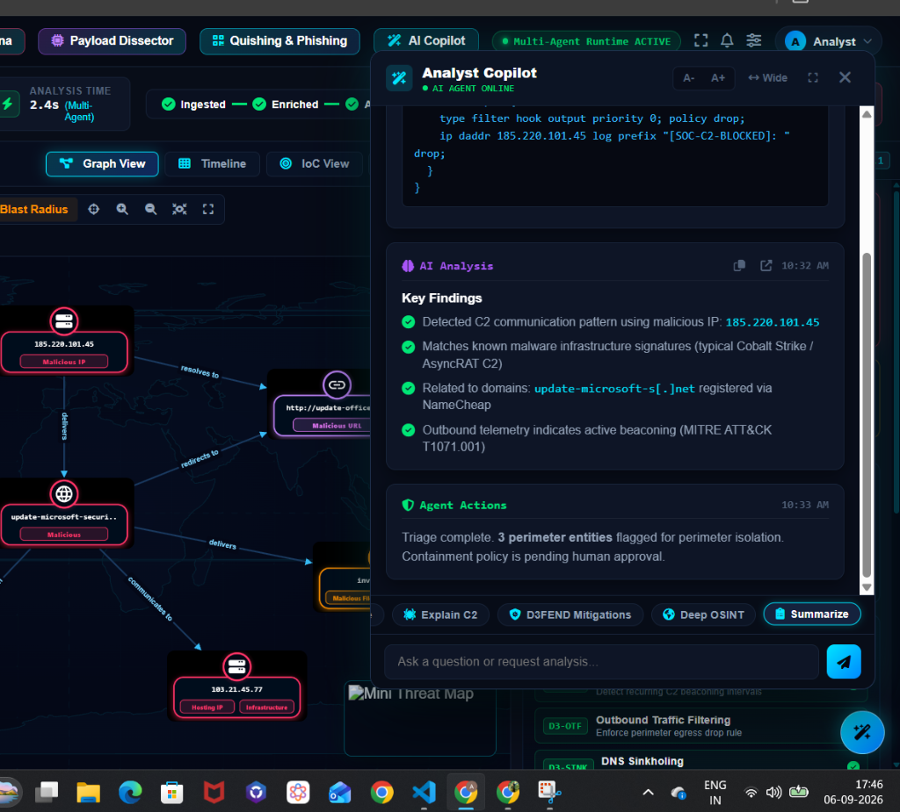 | 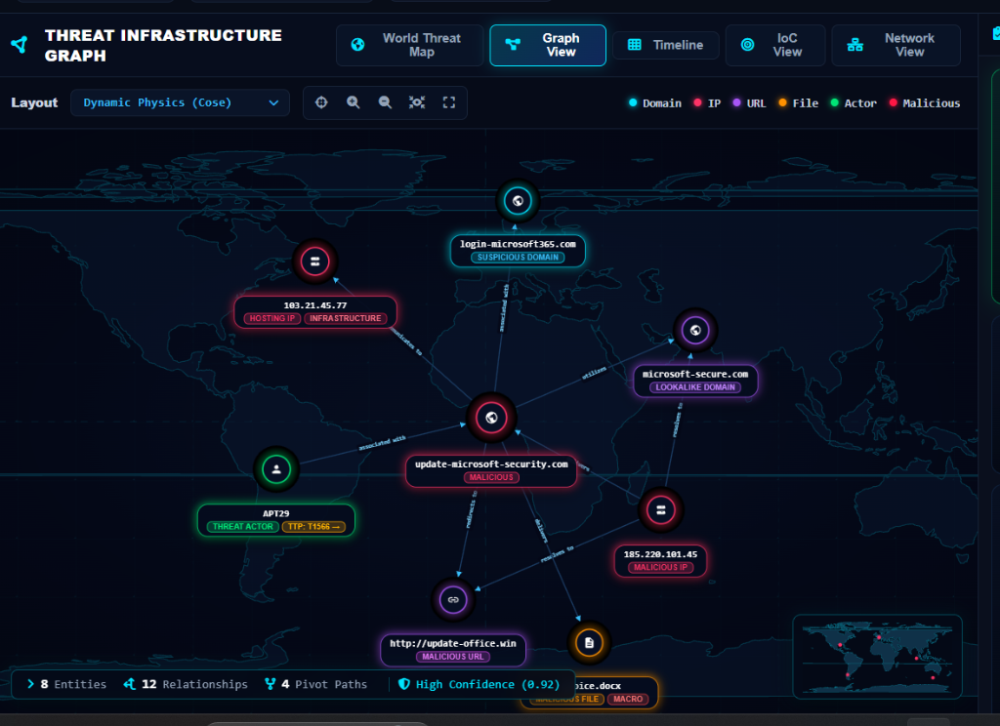 | 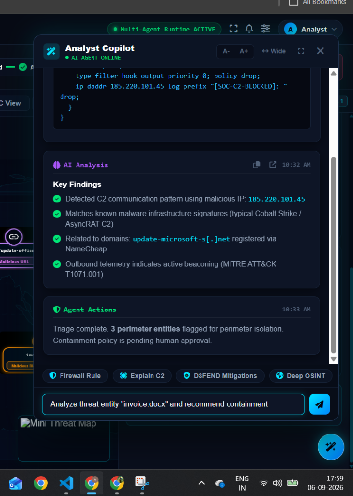 |

---


## 🌟 Executive Overview

**Argus Security Agents (Cyber Sentinel XDR)** is a state-of-the-art autonomous multi-agent cybersecurity operations platform. Engineered on **LangGraph**, **FastAPI**, and modern **XDR Operations Architecture**, Argus orchestrates specialized AI agents capable of end-to-end incident investigation, cross-subgraph pivoting, proactive cyber deception, and adversarial red vs. blue self-play.

### Key Capabilities at a Glance:
1. **Autonomous Adversarial Arena (Red vs. Blue Self-Play)**: Pits Red Agent adversary emulation (APT29, FIN7, Lazarus Group) against Blue Agent defenders in multi-round duels, calculating real-time Time-to-Detect (TTD ms) and synthesizing verified Sigma detection rules.
2. **Autonomous Attack Path & Blast Radius Predictor**: Monte Carlo simulation of lateral movement radiating from an IOC or compromised host, calculating reachability to Crown Jewel databases, Domain Controllers, and Cloud buckets within 1-3 pivot hops; computes Mean Time to Breach (MTTB in min); identifies proactive "Chokepoint Defenses"; and overlays glowing dashed amber paths directly onto Cytoscape.js.
3. **Autonomous Binary & Payload Dissection Agent (Static Reverse Engineering)**: Safe static reverse engineering of malicious payloads (`invoice.docx`, `stager.exe`, `rat_client.bin`), extracting section Shannon entropy scores, identifying suspicious Win32 APIs (`VirtualAllocEx`, `WriteProcessMemory`, `CreateRemoteThread`), de-obfuscating strings (Base64/XOR/ROT13), and synthesizing dynamic YARA-L memory rules.
4. **Generative Chameleon Honeytokens & Deception Sinks**: Dynamically deploys contextual decoy credentials (fake AWS keys, canary database strings, decoy JWTs) to bait and trap lateral movement attempts.
5. **GraphRAG Multi-Hop Deep Threat Hunting**: Recursive 3-hop graph traversal uncovering hidden C2 infrastructure, bulletproof hosting networks, and shared registrant footprints.
6. **Dual Threat Infrastructure Visualization**: High-resolution interactive Cytoscape.js threat graph coupled with a Leaflet & D3 cyber world map displaying real-time geographic attack origin telemetry.
7. **Human-in-the-Loop (HITL) Containment Gateway**: Strict RBAC-enforced safety policies preventing unverified quarantine actions while allowing sub-second containment when approved.
8. **Enterprise Guardrails AI & PII Masking**: Real-time interception of prompt injections, jailbreaks, and sensitive internal IP topology leaks.

---

## 🏛️ System Architecture

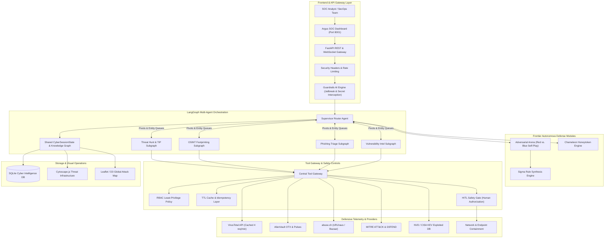

---

## 🗺️ Master Multi-Agent Architecture (LangGraph)

Below is the complete multi-agent execution graph across all autonomous subgraphs, generated directly from the compiled LangGraph state machines:

<p align="center">
  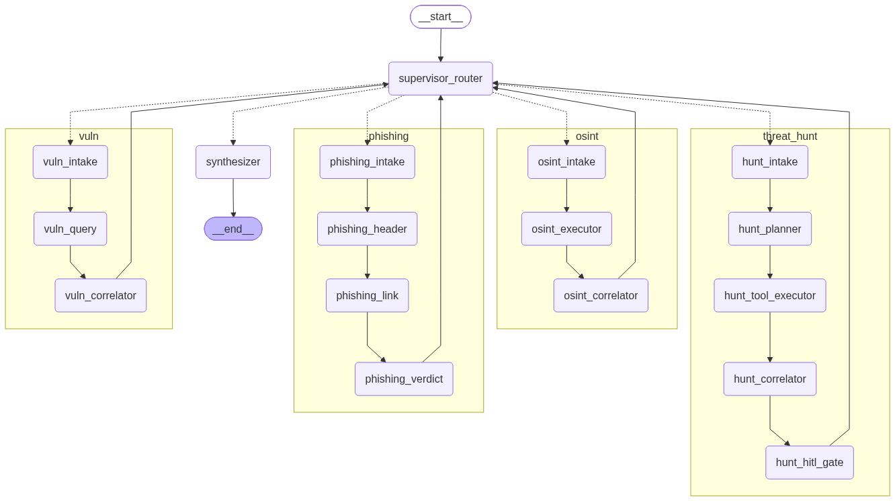
</p>

### Autonomous Subgraphs & Specialized Agents

| Threat Hunting & TIP Subgraph | OSINT Footprinting Subgraph |
| :---: | :---: |
| 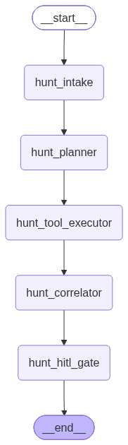 | 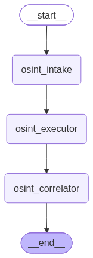 |

| Phishing & Quishing Triage Subgraph | Vulnerability Intelligence Subgraph |
| :---: | :---: |
| 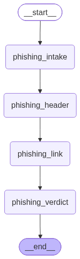 | 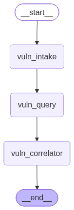 |

### High-Level Supervisor Routing Overview

<p align="center">
  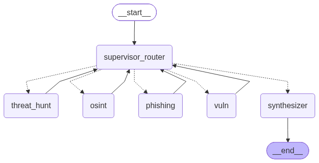
</p>

> **Diagram Regeneration**: You can regenerate and update all LangGraph architecture diagrams at any time using:
> ```bash
> python scripts/generate_graphs.py
> ```

---

## ⚔️ Autonomous Adversarial Arena (Red vs. Blue)


The **Adversarial Arena** provides autonomous Breach & Attack Simulation (BAS) telemetry without generating weaponized malware:

- **Red Agent Personas**:
  - **APT29 / Cozy Bear**: State-sponsored espionage, OAuth consent lures, timestomping, and masqueraded TLS C2 beaconing.
  - **FIN7 / Carbanak Group**: Financial syndicate, weaponized macro attachments, reflective DLL injection, and encrypted 7z POS exfiltration.
  - **Lazarus Group / APT38**: Crypto-theft & critical infrastructure disruption, supply chain npm postinstall hooks, LSASS memory dumping, and high-entropy DNS tunneling.
- **Blue Agent Defenses**:
  - Emulates 3 posture profiles: `Strict Zero-Trust`, `Balanced SOC`, and `Aggressive Autonomous`.
  - Calculates sub-second **Time-to-Detect (TTD in ms)** per round.
  - Executes instant containment (host isolation, token revocation, firewall perimeter block).
  - Automatically synthesizes **production-ready Sigma detection rules** in YAML format.

---

## 🍯 Generative Chameleon Deception Operations

Argus actively deploys dynamic honeytoken decoys into simulated production assets:
- **Canary AWS Access Keys**: `AKIA...` tokens monitored for unauthorized AWS STS queries.
- **Decoy JDBC Connection Strings**: Monitored for rogue SQL reconnaissance.
- **Canary JWT Auth Tokens**: Signed with trapped sub claims alerting when parsed.
- **Canary Web Endpoints**: Hidden admin/metrics endpoints triggering automated IP containment upon probe.

## ⚡ Autonomous Attack Path & Blast Radius Predictor

When an IOC or compromised host is identified, Argus simulates lateral movement trajectories across enterprise network topology and Active Directory / Cloud IAM domains using Monte Carlo simulation (500 iterations):
- **Crown Jewel Reachability**: Maps which PostgreSQL PCI vaults, Active Directory Domain Controllers (`DC-CORP-01`), and AWS S3 financial buckets (`s3://corp-finance-vault-prod`) are within 1-3 pivot hops.
- **Mean Time to Breach (MTTB)**: Computes realistic velocity metrics (e.g. 18-minute compromise window).
- **Proactive Chokepoint Defenses**: Recommends high-impact tactical isolations (e.g., `CP-01: Zero-Trust ACL on Port 5432`, `CP-02: Sever Kerberos Constrained Delegation`, `CP-03: Invalidate AWS STS credentials`) that sever up to 45% of potential lateral pathways.
- **Cytoscape Canvas Overlay**: Injects predicted trajectories onto the interactive canvas in glowing dashed amber lines (`isAttackPath: true`) with sub-second path layout calculation.

---

## 🔬 Autonomous Binary & Payload Dissection Agent

Argus features an agentic static reverse engineering pipeline designed for zero-trust environments:
- **Shannon Entropy Profiling**: Computes byte distribution entropy across PE and macro sections (`.text`, `.rdata`, `.rsrc`, `word/vbaProject.bin`). Sections exceeding 7.0 entropy are flagged as heavily packed, encrypted, or containing weaponized shellcode.
- **Suspicious Win32 API Cataloging**: Scans Import Address Tables (IAT) and flags offensive API patterns (`VirtualAllocEx`, `WriteProcessMemory`, `CreateRemoteThread`, `MiniDumpWriteDump`, `AdjustTokenPrivileges`) correlated to MITRE ATT&CK tactics (T1055, T1003, T1056).
- **Automated String De-obfuscation**: Detects and decodes hidden payload strings encoded in Base64 (including UTF-16LE PowerShell commands), XOR byte ciphers, and Caesar/ROT13 obfuscation.
- **Dynamic YARA-L Rule Synthesis**: Automatically generates production-ready YARA-L memory rules containing extracted byte signatures and API combinations for instant deployment to SIEM and EDR fleets.

---

## 📁 Repository Structure

```
cyber-agent/
├── agents/
│   ├── arena/               # Adversarial Arena Red vs Blue engine
│   │   ├── __init__.py
│   │   └── engine.py        # Kill-chain emulation & Sigma synthesis
│   ├── osint/               # OSINT & domain footprinting subgraph
│   ├── phishing/            # Phishing triage & email header analysis
│   ├── supervisor/          # LangGraph supervisor router
│   ├── threat_hunt/         # Threat intelligence & MITRE mapping
│   └── vuln/                # CVE, CVSS, and CISA KEV intelligence
├── apps/
│   └── api/
│       ├── main.py          # FastAPI application entrypoint
│       ├── routes/          # Modular API route controllers
│       │   ├── arena.py     # Adversarial Arena endpoints
│       │   ├── blast_radius.py # Attack Path & Blast Radius endpoints
│       │   ├── chat.py      # Guardrail-protected chat
│       │   ├── deception.py # Chameleon honeytoken deployment
│       │   ├── hitl.py      # Human-in-the-loop review
│       │   ├── investigation.py # Threat investigation endpoints
│       │   └── malware.py   # Binary & payload dissection endpoints
│       └── static/          # Segregated high-performance web dashboard
│           ├── assets/      # SVG maps and branding icons
│           ├── components/  # Modular HTML dialogs (arena, blast_radius, malware, copilot)
│           ├── css/         # Modular styles (styles.css)
│           ├── js/          # Segregated client orchestrators
│           │   ├── app.js
│           │   ├── arena.js
│           │   ├── blast_radius.js
│           │   ├── copilot.js
│           │   ├── deception.js
│           │   ├── graph.js
│           │   └── malware.js
│           └── index.html   # Lean main dashboard shell
├── core/
│   ├── gateway/             # Central Tool Gateway with RBAC & cache
│   ├── permissions/         # AgentRole permission matrices
│   └── state/               # Shared CyberSessionState models
├── security/
│   └── guardrails_engine.py # Prompt injection & secret leakage shields
├── storage/
│   └── db.py                # SQLite persistence (investigations, arena, attack paths, malware)
├── tools/
│   ├── blast_radius.py      # Monte Carlo lateral attack path & chokepoint engine
│   ├── deception.py         # Chameleon honeytoken generator
│   └── malware_dissector.py # Shannon entropy, PE parsing, de-obfuscation & YARA
└── tests/
    ├── integration/         # API & supervisor cross-routing tests
    └── unit/                # Engine, permissions, and tool unit tests
```

---

## 🚀 Getting Started

### 1. Prerequisites
- Python 3.12+
- Node.js (optional, for asset linting)

### 2. Environment Setup
```bash
git clone https://github.com/Aman9868/Argus-Security-Agents-.git
cd Argus-Security-Agents-
python3 -m venv .venv
source .venv/bin/activate
pip install -r requirements.txt
```

Configure your environment variables:
```bash
cp .env.example .env
```
Supported API keys (deterministic offline fallbacks enabled by default):
- `GROQ_API_KEY`: Ultra-fast inference with Llama-3.3-70b
- `GEMINI_API_KEY`: Google Gemini Flash fallback
- `LANGCHAIN_API_KEY`: LangSmith tracing (`cyber-agent-prod`)
- Threat intel keys (optional): `ABUSEIPDB_API_KEY`, `VIRUSTOTAL_API_KEY`, `OTX_API_KEY`, `SHODAN_API_KEY`, `NVD_API_KEY`

### 3. Launch Platform
```bash
uvicorn apps.api.main:app --host 127.0.0.1 --port 8001 --reload
```
Navigate to **`http://127.0.0.1:8001`** in your browser.

---

## 🧪 Test Verification

Run the full automated test suite (unit tests, integration tests, security guardrails):

```bash
pytest tests/ -v
```

```
======================= 72 passed, 32 warnings in 15.56s =======================
```
```

- `test_arena_engine.py`: Multi-stage APT duel simulation, scoring, and Sigma generation.

- `test_arena_endpoints.py`: Match replay, history retrieval, and persona catalog.
- `test_api_endpoints.py`: Health checks, guardrail prompt injection interception, and HITL approvals.
- `test_supervisor_cross_routing.py`: Dynamic cross-subgraph state transitions.
- `test_guardrails.py`: Protection against jailbreaks, prompt injection, and credential exfiltration.

---

## 📡 API Reference

| Method | Endpoint | Description |
|---|---|---|
| `GET` | `/api/health` | Service health and provider status |
| `POST` | `/api/investigation/run` | Triggers autonomous multi-agent investigation on target IOC |
| `GET` | `/api/investigation/{id}/graph` | Retrieves Cytoscape.js knowledge graph nodes and edges |
| `POST` | `/api/chat` | Analyst Copilot chat with Guardrails AI protection |
| `GET` | `/api/hitl/pending` | Lists staged containment actions awaiting human approval |
| `POST` | `/api/hitl/review` | Approves or rejects a staged containment action |
| `POST` | `/api/arena/simulate` | Executes Red vs. Blue Adversarial Arena duel |
| `GET` | `/api/arena/history` | Fetches history of past arena combat simulations |
| `GET` | `/api/arena/match/{id}` | Replays round-by-round duel telemetry and Sigma rules |
| `GET` | `/api/arena/personas` | Lists supported APT adversary personas and defensive postures |
| `GET` | `/api/deception/traps` | Lists active Chameleon honeytokens and trip status |
| `POST` | `/api/deception/deploy` | Deploys a new decoy honeytoken into the environment |
| `POST` | `/api/deception/trip` | Simulates an intruder probing an active honeytoken |

---

## 🔒 Security & Safe AI Practices

- **Strict Breach & Attack Simulation (BAS) Safety**: Red agent activities simulate telemetry signatures, log events, and network packets. No actual weaponized exploit binaries or harmful payload scripts are compiled or distributed.
- **SQL Injection Immunization**: All SQLite database interactions strictly use parameterized queries (`?`).
- **Least Privilege Enforcement**: Subgraph agents are constrained by explicit RBAC rules. Threat analysis agents cannot perform perimeter firewall changes without HITL authorization.
- **PII & RFC 1918 Masking**: Enterprise internal subnet ranges and secrets are masked prior to presenting data in UI components or external reports.

---

## 📄 License
Licensed under the [Apache License 2.0](LICENSE).
