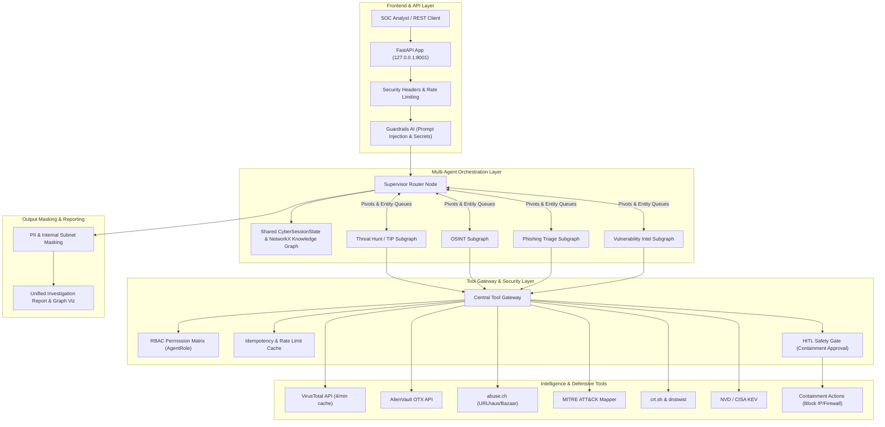

# Cyber Sentinel — Multi-Agent Cybersecurity Platform

An autonomous multi-agent security investigation platform (Threat Hunting & TIP, OSINT Footprinting, Phishing Triage, and Vulnerability Intelligence) orchestrated with **LangGraph**, **FastAPI**, a **Central Tool Gateway (RBAC & Idempotency)**, **Enterprise Security Guardrails AI**, **PII & Internal Secret Masking**, and a **SOC Analyst Operations Dashboard**.

---

## 🏛️ System Architecture



---

## 🛡️ Enterprise Security & Guardrails

- **Tool Gateway with RBAC**: Each agent runs with strict least-privilege permissions (`AgentRole`). Threat Hunters and OSINT analysts cannot trigger active containment tools (`block_ip`, `quarantine_domain`).
- **Idempotency & Rate Limiting**: All intelligence tool calls are cached with TTL to prevent burning third-party API rate limits (e.g. VirusTotal 4 req/min free limit).
- **Enterprise Guardrails AI Engine**: Intercepts prompt injections, jailbreaks (`DAN` mode, rule bypasses), system prompt exfiltration, and prohibited credential submissions.
- **PII & Internal Topology Masking**: Automatically redacts RFC 1918 internal IP ranges (`10.0.0.0/8`, `172.16.0.0/12`, `192.168.0.0/16`), API keys, and sensitive tokens from analyst reports and logs.
- **Human-in-the-Loop (HITL) Containment**: High-impact containment actions (`BLOCK_IP`, `QUARANTINE_DOMAIN`) require explicit human authorization before perimeter execution.

---

## 🚀 Quickstart

### 1. Environment Setup

```bash
cd /home/itsam/Projects/cyber-agent
cp .env.example .env
```

Your `.env` already reuses existing keys from `banking-agent`:
- `GROQ_API_KEY`: Groq Llama-3.3-70b & Llama-3.1-8b
- `GEMINI_API_KEY`: Google Gemini 2.5 Flash fallback
- `LANGCHAIN_API_KEY`: LangSmith tracing project `cyber-agent-prod`
- Free tier threat intel keys (optional): `VIRUSTOTAL_API_KEY`, `OTX_API_KEY`, `SHODAN_API_KEY`, `NVD_API_KEY`

### 2. Run Tests

```bash
pytest tests/ -v
```

100% test coverage with deterministic offline fallback for all threat intelligence providers and LLMs.

### 3. Launch the Platform

```bash
uvicorn apps.api.main:app --host 127.0.0.1 --port 8001 --reload
```

Open [http://127.0.0.1:8001](http://127.0.0.1:8001) in your browser to access the SOC Analyst Dashboard.

---

## 📡 API Reference

| Method | Endpoint | Description |
|---|---|---|
| `GET` | `/api/health` | Service health and provider status |
| `POST` | `/api/chat` | Protected analyst chat with Guardrails AI |
| `POST` | `/api/investigation/run` | Triggers autonomous multi-agent investigation |
| `GET` | `/api/investigation/{id}/graph` | Retrieves Cytoscape.js knowledge graph elements |
| `GET` | `/api/hitl/pending` | Lists staged containment actions awaiting approval |
| `POST` | `/api/hitl/review` | Approves or rejects a staged containment action |

---

## 🔍 Investigation Subgraphs

1. **Threat Hunting & TIP (`agents/threat_hunt`)**:
   - Seeds target IOC, queries VirusTotal, OTX, abuse.ch, maps behaviors to MITRE ATT&CK techniques.
   - Extracts emergent lookalike domains and C2 infrastructure into the cross-subgraph pivot queue.
2. **OSINT Subgraph (`agents/osint`)**:
   - Queries `crt.sh` for certificate transparency logs and `dnstwist` for typosquatting/homoglyph attacks.
   - Correlates discovered subdomains and lookalikes into the shared knowledge graph.
3. **Phishing Subgraph (`agents/phishing`)**:
   - Analyzes RFC 5322 email headers for SPF/DKIM/DMARC authentication and spoofing.
   - Extracts embedded URLs, scores risk, and pivots extracted origin IPs to the threat hunt subgraph.
4. **Vulnerability Subgraph (`agents/vuln`)**:
   - Queries NVD CVSS scores and CISA Known Exploited Vulnerabilities (KEV) catalog.
5. **Supervisor Agent (`agents/supervisor`)**:
   - Evaluates accumulated state and pivot queues, routing dynamically between subgraphs when new entity types emerge, culminating in a unified incident synthesis.

